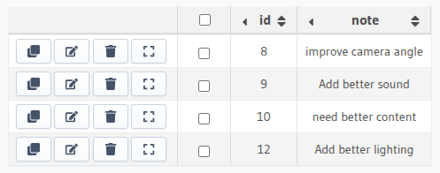

# YouTube Companion Dashboard

The **YouTube Companion Dashboard** is a React-based web application that enhances your YouTube viewing experience by providing features like video details, comments, and note-taking.

## Features

- **Video Details**: View video information such as title, description, views, likes, and published date.
- **Comments**: Add, edit, and delete comments and replies.
- **Notes**: Take notes related to the video, search through notes, and save them to a backend.
- **Edit Video Details**: Update the title and description of the video.

## Tech Stack

- **Frontend**: React, Vite
- **Styling**: CSS
- **Backend**: Hasura GraphQL API
- **Deployment**: Netlify


## Environment
```
VITE_API_BASE_URL=<Your API Base URL>
VITE_HASURA_ADMIN_SECRET=<Your Hasura Admin Secret>
```

## Start dev server
```
npm run dev
```

## DB Table Notes



## API
1. Get Notes - host/notes [GET]
2. Add Note - host/note [POST]
3. Video Details - https://serpapi.com/searches/f68c6a72c6fa6187/68297f9227c2b0aeb2794e04.json
